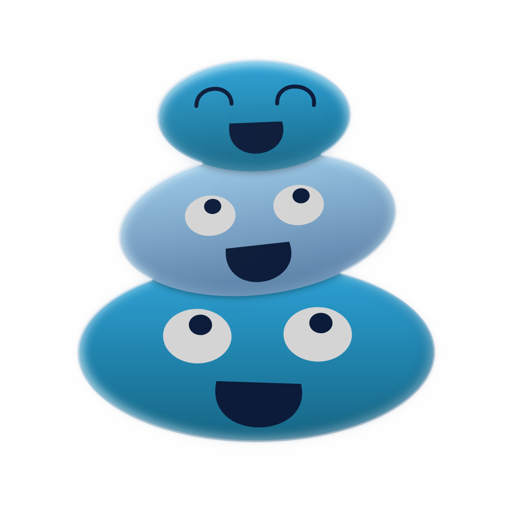

# Harmony Desktop



A desktop client for **Harmony** that connects to **many servers at once**.
Harmony itself is one instance, one community; this client puts a Discord-style
server rail on the left and gives each server its own isolated session, so you
can be signed into several communities side by side.

This repository does not vendor Harmony. Drop a checkout of the Harmony source
tree at `harmony/` (git-ignored) if you want to run an instance locally to test
against.

## How it works

Every server is rendered in its own Electron `<webview>`, loaded from that
server's own URL and pinned to a persistent session partition named after the
server. Two consequences fall out of that:

- **Isolation is real.** Cookies, storage and sign-in state are kept per server,
  so being logged into one community never leaks into another.
- **The client is always current.** It serves each server's own Harmony web
  client from that server, so there is no bundled copy to fall out of date.

The shell around it adds the parts Harmony does not have: a server rail with
unread-mention badges, an add-server flow that verifies the address against
`GET /api/v1/meta` and caches the instance icon, a native right-click menu, and
a remembered last-active server.

## Requirements

- [Node.js](https://nodejs.org) 20 or newer
- A Harmony instance to point at (run one from the Harmony source tree if you
  just want to try it)

## Development

```sh
npm install
npm start
```

Add a server with the **+** button: type an address such as `chat.example.com`
(https is assumed) or `localhost:8787` (loopback defaults to http). The client
contacts `GET /api/v1/meta` to confirm it is a Harmony instance and to pick up
its name and icon.

### Tests

```sh
npm test     # plain-Node tests: the server store and the metadata fetcher
npm run smoke   # boots the real app headlessly against a fake Harmony server
```

`npm run smoke` needs a display. On a headless machine, add
`--no-sandbox --disable-gpu --in-process-gpu`:

```sh
npx electron scripts/smoke.js --no-sandbox --disable-gpu --in-process-gpu
```

## Building installers

```sh
npm run pack        # unpacked app in release/, for the current platform
npm run dist        # installers for the current platform
npm run dist:linux  # AppImage + deb
npm run dist:win    # NSIS installer
npm run dist:mac    # dmg
```

The app icon is `build/icon.png`; electron-builder derives the platform icons
from it. Output lands in `release/` (git-ignored). Artifacts are unsigned.

**Cross-building.** Only the Linux targets build cleanly on a Linux host. The
Windows installer step runs `signtool`/resource editing through Wine even when
unsigned, so `npm run dist:win` on Linux fails with `wine process failed ENOENT`
unless [Wine](https://www.winehq.org/) is installed (`sudo pacman -S wine` on
Arch/CachyOS). A macOS `dmg` can only be built on macOS.

The straightforward way to get all three is the
[`Build` workflow](.github/workflows/build.yml): it runs each platform on its
own native runner, uploads the installers as artifacts, and is what you would
extend if you later add code signing. No Wine, no cross-tooling.

## Known advisories

`npm audit` reports eight high-severity entries after a dev install. They are a
single advisory — `GHSA-ch52-4w7c-c8xp`, *http-cache-semantics max-stale
handling can disclose cross-user cached responses* — fanned out across
`electron-builder`'s download tooling:

```
electron-builder → app-builder-lib → @electron/get → got → cacheable-request
                 → http-cache-semantics
```

It is **build-time only**. `electron-builder` is a dev dependency, nothing from
`node_modules` ships in the app (the packaged `app.asar` holds just
`package.json` and `src/`), and `npm audit --omit=dev` reports nothing. The
advisory is unpatched upstream — `4.2.0` is the newest release and is still in
range — so `npm audit fix` only offers to *downgrade* `electron-builder`. Leave
it, and re-check with `npm audit` before cutting a release.

## Where your data lives

Servers, cached icons and the last-active selection are kept in the Electron
`userData` directory (`~/.config/Harmony` on Linux,
`~/Library/Application Support/Harmony` on macOS, `%APPDATA%\Harmony` on
Windows). Each server's own session lives under `Partitions/` in the same
directory, so removing a server also removes its stored sign-in state when you
delete that partition folder.

## License

AGPL-3.0-or-later, matching Harmony. The icon is Harmony's own.
